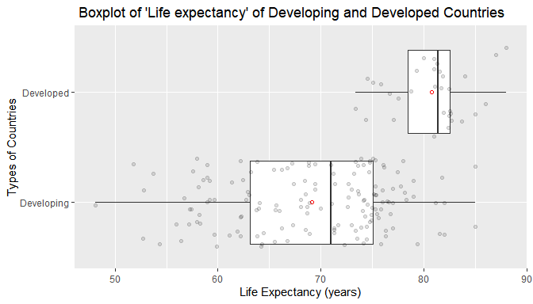

 
# Introduction

R-pub link: https://rpubs.com/kabir_data_worm/680654

- Life expectancy refers to a measure describing how long a person would like to live.

- Previous studies show that life expectancy varies among the countries worldwide due to different socioeconomic and health factors (Khan, Khan, & Khan, 2010; Lin, Chen, Chien, & Chan, 2012).

-  A better understanding of the difference in life expectancy in developing and developed countries is of great importance for international and global development.

- In spite of poor health facilities and lower standard of living and education level; the life expectancy in developing countries was increased 3.6 years per decade compare to 1.8 years per decade in developed countries (United Nations, 2017).

- So it is of great interest to know the present condition of developing and developed countries in terms of life expectancy. 


# Problem Statement

- This particular analysis is undertaken to investigate whether the life expectancy in developed countries differs from developing countries or not. 
- In order to address this research question, the data on life expectancy of developed and developing countries have been used over a period of five years. Data is collected from Kaggle. 
- Initially, descriptive statistics and visualizations on important variables are used to search out the impact of development condition of countries on life expectancy parameter.
- Then, all required assumptions are being checked to carry out appropriate hypothesis test
- Next, Hypothesis testing is used to find out any statistically significant difference in life expectancy in between developed and developing countries.
- Finally, a solid discussion is provided to highlight on limitations, strength, future study and ultimate results of the investigation.


# Data

- Data is collected by clicking on the "Download" tab of the webpage of following link: https://www.kaggle.com/kumarajarshi/life-expectancy-who?select=Life+Expectancy+Data.csv 
- The sampling method of the data is not mentioned in data source. 
- The "Life Expectancy Data.csv" data-set contains observations for 193 countries covering the time period from 2000-2015 with 22 variables and 2938 observations.
- However this analysis will work on four variables: Country,Year, Status, Life expectancy. The analysis will cover the years from 2011 to 2015.
- "Country" variable is catagorical type representing each country of the world.
- "Status" is nominal type variable with two categories: Developed, Developing. This variable divides country variable as developed and developing countries.
- "Life expectancy" is ratio type. Each value represents average life length of the people of a particular country. 


# Data cont.
- At first, importing data from working directory with necessary sub-setting and filtering. 
- Checking the attributes of data-frame and class of each variable.


```r
life_expectancy<-read_csv("Life Expectancy Data.csv")%>% select(Country,Year,Status, `Life expectancy`)%>%filter(Year==c(2011:2015))
str(life_expectancy)
```

```
## tibble [185 x 4] (S3: tbl_df/tbl/data.frame)
##  $ Country        : chr [1:185] "Afghanistan" "Albania" "Algeria" "Angola" ...
##  $ Year           : num [1:185] 2013 2011 2014 2012 2015 ...
##  $ Status         : chr [1:185] "Developing" "Developing" "Developing" "Developing" ...
##  $ Life expectancy: num [1:185] 59.9 76.6 75.4 56 76.4 76 73.9 82.7 88 72.7 ...
```
- Changing class of "Status" variable to a factor and defining the levels. 

```r
life_expectancy$Status<-factor(life_expectancy$Status,levels=c("Developing","Developed"))
levels(life_expectancy$`Status`)
```

```
## [1] "Developing" "Developed"
```


# Data Cont.(Handling Missing Values)
- Checking missing values: NA, nan, special values. Output is showing 2 NAs in Life expectancy. 

```r
is.specialorNA <- function(x){if (is.numeric(x)) (is.infinite(x) | is.nan(x) | is.na(x))}
sapply(life_expectancy, function(y)sum(is.specialorNA(y)))
```

```
##         Country            Year          Status Life expectancy 
##               0               0               0               2
```
- Finding location of missing values. Removing 2 missing values as sample size for developing countries is large(153).

```r
life_expectancy[!complete.cases(life_expectancy),]
```

<div data-pagedtable="false">
  <script data-pagedtable-source type="application/json">
{"columns":[{"label":["Country"],"name":[1],"type":["chr"],"align":["left"]},{"label":["Year"],"name":[2],"type":["dbl"],"align":["right"]},{"label":["Status"],"name":[3],"type":["fct"],"align":["left"]},{"label":["Life expectancy"],"name":[4],"type":["dbl"],"align":["right"]}],"data":[{"1":"Nauru","2":"2013","3":"Developing","4":"NA"},{"1":"Saint Kitts and Nevis","2":"2013","3":"Developing","4":"NA"}],"options":{"columns":{"min":{},"max":[10]},"rows":{"min":[10],"max":[10]},"pages":{}}}
  </script>
</div>


```r
life_expectancy<-life_expectancy%>%na.omit()
```

# Descriptive Statistics and Visualisation


```r
life_expectancy%>%group_by(Status)%>%summarise(Min = min(`Life expectancy`,na.rm = TRUE),Q1 = round(quantile(`Life expectancy`,probs = .25,na.rm = TRUE),2), Median = round(median(`Life expectancy`, na.rm = TRUE),2), Q3 = round(quantile(`Life expectancy`,probs = .75,na.rm = TRUE),2),Max = max(`Life expectancy`,na.rm = TRUE),IQR=IQR(`Life expectancy`,na.rm = TRUE),Mean = round(mean(`Life expectancy`, na.rm = TRUE),2),SD = round(sd(`Life expectancy`, na.rm = TRUE),2), IQR = IQR(`Life expectancy`, na.rm = TRUE), Range= Max-Min,n = n(),Missing = sum(is.na(`Life expectancy`))) -> table1
knitr::kable(table1)
```


|Status     |  Min|    Q1| Median|    Q3| Max|   IQR|  Mean|   SD| Range|   n| Missing|
|:----------|----:|-----:|------:|-----:|---:|-----:|-----:|----:|-----:|---:|-------:|
|Developing | 48.1| 63.15|   71.0| 75.05|  85| 11.90| 69.12| 7.73|  36.9| 151|       0|
|Developed  | 73.4| 78.47|   81.4| 82.53|  88|  4.05| 80.74| 3.67|  14.6|  32|       0|
## Observations
- Life expectancy of developed countries is at least 10 years more than that of developing countries considering both mean and median values.
- Median value of life expectancy for developing countries(71) is lower than minimum value (73.4) of life expectancy of developed countries.
- Range of life expectancy of developing countries is 2.5 times larger than that of developed countries.
- IQR of developed countries is 4.05 in contrast to 11.9 for developed countries.


# # Decsriptive Statistics: Boxplot of Life Expectancy 

```r
qplot(`Life expectancy`,Status,data=life_expectancy,geom='boxplot')+stat_summary(fun.y=mean,shape=1,col='red',geom='point')+labs(title=" Boxplot of 'Life expectancy' of Developing and Developed Countries", x = "Life Expectancy (years)", y = "Types of Countries")+ geom_jitter(alpha = 1/8)
```


So there is no outlier. Red points represent mean value that differs more than 10 years in between two types of countries.Box-plot shows that life expectancy varies a lot in developing countries compared to developed countries. Developed countries have higher life expectancy than developing countries.

# Decsriptive Statistics Cont.(Visualisation)
- Life expectancy distribution for developing countries is negatively skewed with a fat left tail, right tail is slim. 
- Distribution for developed countries is showing characteristics of standard normal distribution relatively more.

```r
ggplot(life_expectancy , aes(x=`Life expectancy`, fill=Status))+geom_histogram(alpha=0.5,position = 'identity', colour='black',binwidth =1.8 )+ labs(title="    Histogram of Life Expectancy of Developing & Developed Countries",x="Life Expectancy (Years)", y="Frequency")
```


#  Visualisation:QQ Plot for Developing Countries


```r
life_developing<-life_expectancy%>%filter(Status=="Developing")
life_developing$`Life expectancy`%>%car::qqPlot(dist="norm",ylab="Life expectancy(years)",main = "Developing Countries", col = "red")
```


```
## [1] 120  30
```


#  Visualisation:QQ Plot for Developed Countries

```r
life_developed<-life_expectancy%>%filter(Status=="Developed")
life_developed$`Life expectancy`%>%qqPlot(dist="norm",ylab="Life expectancy(years)",main = "Developed Countries", col = "red")
```


```
## [1] 16  2
```

# Visualisation:Important features of data visualisation:

- Histogram of life expectancy for developed countries shows less variation among the countries. All developed countries have life expectancy more than 73 years.

- Histogram of life expectancy of developing countries shows a lot of variation in a wider range compared to developed countries. Some developing countries have life expectancy below 55 years,majority in between 60 to 72 years, very few have over 72 years in a range of 5 years from 2011 to 2015.

- So it is clear from visualisation that developed countries have higher life expectancy. But we are not sure whether this difference is statistically significant or not.

- Both QQ plot shows 'S' patterns. QQ plot for developing countries clearly shows left-skewness. Many data falls outside of dotted lines as well. So this distribution may not be normal.  

- In case of QQ plot for developed countries, we can assume normality considering 95% CI of normal quantiles. Because almost all of the data falls inside to the dotted lines.

# Hypothesis Testing: Normality Checking
- QQ plot shows that data is not normal for developing countries. However, it is a close call. For confirmation, we are checking normality characteristics of data using Shapiro-Wilk's method.

```r
shapiro.test(life_developing$`Life expectancy`)
```

```
## 
## 	Shapiro-Wilk normality test
## 
## data:  life_developing$`Life expectancy`
## W = 0.96354, p-value = 0.0005007
```

```r
shapiro.test(life_developed$`Life expectancy`)
```

```
## 
## 	Shapiro-Wilk normality test
## 
## data:  life_developed$`Life expectancy`
## W = 0.95602, p-value = 0.2132
```
- As p-value<.05, Data is not normally distributed for developing countries. For developed countries, P-value>.05, So data is normally distributed 


# Hypothesis Testing:cont.
- We can still go for t-test following central limit theorem as sample size is larger than 30.
- Prior proceeding to t-test, we are confirming homogeneity of variances of life expextancy in between developing and developed countries using Levene's Test.

## Levene's Test For Homogeneity Of Variance.
- The following statistical hypotheses is used to verify equal variance. 
- Null Hypothesis, denoted as $H_0$ assumes that there is equality in variances of Life expectancy parameter in between developing and developed countries.  
- Alternate Hypothesis, denoted as $H_A$ assumes non-existence of homogeneity in variances of Life expectancy parameter in between developing and developed countries. 
- Here, σ1 and σ2 refer to the  variance in life expectancy of developing and developed countries respectively.

$$H_0: \sigma_1^2 = \sigma_2^2 $$

$$H_A: \sigma_1^2 \ne \sigma_2^2$$


# Levene's Test, continuing....   

Here is the R code for Levene’s test:


```r
leveneTest(`Life expectancy` ~ as.factor(Status), data = life_expectancy)%>%knitr::kable()
```


|      |  Df|  F value|   Pr(>F)|
|:-----|---:|--------:|--------:|
|group |   1| 19.56093| 1.68e-05|
|      | 181|       NA|       NA|

## Explanation:
- The p-value for the Levene’s test of equal variance for Life expectancy between developing and developed countries is less than 0.001; i.e p-value<0.05 . So, Levene’s test is statistically significant to reject null hypothesis. F=19.56,p<0.001 
- That means equal variance for Life expectancy between developing and developed countries is not existing. 
- So, for further analysis Welch Two-sample t-test - assuming unequal variance is necessary.

# Welch Two Sample t-test: Unequal Variance
- Welch two-sample(independent) t-test assuming unequal variance is used to determine if the mean life expectancy of developing countries are significantly different from developed countries.The following statistical hypotheses are used:
- Null hypothesis: denoted as $H_0$ assumes that the difference between means of Life expectancy of developed and developing countries is 0.
- Alternate hypothesis:denoted as $H_A$ assumes that the difference between means of Life expectancy of developed and developing countries is not 0. Here are the mathematical representations of two hypothesis.
   
   Here, $\mu_1$ and $\mu_2$ refers to the  mean value of life expectancy of developing and developed countries.


$$H_0: \mu_1 - \mu_2=0 $$

$$H_A: \mu_1 - \mu_2\ne0$$

- The output of the R-code of next slide is showing the details of "Welch two-sample unequal varience t-test" for this analysis.

# Welch Two Sample t-test:Cont... 


```r
t.test(`Life expectancy` ~ as.factor(Status), data = life_expectancy,var.equal = FALSE, alternative = "two.sided")
```

```
## 
## 	Welch Two Sample t-test
## 
## data:  Life expectancy by as.factor(Status)
## t = -12.841, df = 98.577, p-value < 2.2e-16
## alternative hypothesis: true difference in means between group Developing and group Developed is not equal to 0
## 95 percent confidence interval:
##  -13.407625  -9.818368
## sample estimates:
## mean in group Developing  mean in group Developed 
##                  69.1245                  80.7375
```
## Decision:
  + The result of Welch Two Sample (independent) t-test shows that p-value is less than 0.001, i.e p-value<.05  
  + 95% CI [-13.41 -9.82] is not catching null hypothesis. 
  + So two-sample t-test assuming unequal variance finds statistically significant results to reject null hypothesis. 

# Explanation of Hypothesis Test
   - Welch two-sample t-test is used to test for a significant difference between the mean life expectancy of developing and developed countries. 
   - While the life expectancy for developing countries exhibits evidence of non-normality upon inspection of the normal Q-Q plot and results of Shapiro-Wilk's test , the central limit theorem ensures that the t-test can be applied due to the large sample size in each group. 
   - The Levene’s test of homogeneity of variance indicates that equal variance can not be assumed. 
   - The results of the two-sample t-test assuming unequal variance finds a statistically significant difference between the mean life expectancy of developing and developed countries, t(df=98)= 12.841, p < 0.001, 95% CI for the difference in means [-13.41  -9.82]. 
   - The results of the investigation suggest that developed countries have significantly higher average life expectancy than developing countries.


# Discussion

- Descriptive statistics and visualizations shows significant difference in life expectancy in between developing and developed countries. On hypothesis testing, it is confirmed that null hypothesis does not stand, hence rejected.
- Strength of this analysis:
    + No outliers, very few missing values.
    + Very consistent results across descriptive statistics, visualisations and hypothesis tests.
- Limitation of the analysis:
    + The investigation does not count the impact of other variables on life expectancy such as genetics, war, natural calamities, diseases etc.
    + Sampling method of the data is not mentioned by the data source.
- Future investigation may take into account:
    + clear mentioning of sampling method.
    + all influential factors (economy, genetics,geography, war) of life expectancy.
- Inspite of recent progress on life expectancy in developing countries,this analysis reveals that developed countries still have statistically significant higher life expectancy than developing countries.


# References

- Kaggle. *Life Expectancy (WHO),
Statistical Analysis on factors influencing Life Expectancy*,retrieved on 28 September, 2020 from
   https://www.kaggle.com/kumarajarshi/life-expectancy-who?select=Life+Expectancy+Data.csv 

- Khan, A., Khan, S., & Khan, M. (2010). *Factors effecting life expectency in developed and developing countries of the world (An approach to available literature).* International Journal of Yoga, Physiotherapy and Physical Education, 1(1), 04-06. 

- Lin, R.-T., Chen, Y.-M., Chien, L.-C., & Chan, C.-C. (2012). *Political and social determinants of life expectancy in less developed countries: a longitudinal study.* BMC Public Health, 12(1), 85. 

- United Nations. (2017). *Life expectancy at birth increasing in less developed regions*, retrieved on 28 September, 2020 from https://www.un.org/en/development/desa/population/publications/pdf/popfacts/PopFacts_2017-9.pdf. 
